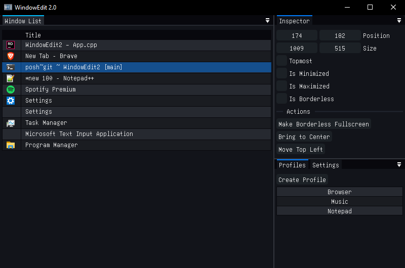

# Window Edit 2.0

A Windows utility for managing, repositioning, and resizing open application windows. It's great for rescuing off-screen
windows, or forcing any application into borderless fullscreen.

The project is a rewrite of an older project of mine from 2018 that I called Window Edit (I am really good with names, I
know.), so naturally this project is Window Edit 2. I decided to rewrite it because I had a growing list of features
that I had been wanting to add, but the old codebase was annoying to work in. I also wanted to try out new technologies
for writing GUI applications in a more rapid way.

## Features

The standout feature of Window Edit is the ability to make any application borderless fullscreen. This removes the title
bar and window borders and stretches the window to fill your entire screen. This is great for older games that only
support exclusive fullscreen or windowed mode. There are also features that are useful if you end up with a window that
is stuck off-screen, or positioned in a way where you are not able to drag it back into position.

**Notable features include:**
- View all open windows, with an option to include invisible windows
- Double-click any window in the list to focus it
- View the executable path of the application that owns a window
- Move, resize, and control the state of any window
- Bring off-screen windows back to center
- Save window position profiles and apply them to any window
- Force any application into borderless fullscreen
- Close windows via the right-click context menu
- Undo any change with Ctrl+Z

## Libraries used
- **SDL3** for windowing and as the rendering backend
- **Dear Imgui** for the GUI
- **Freetype** for nice text rendering

## Download

Grab the latest release from the [Releases](https://github.com/smeas/WindowEdit2/releases/latest) page.
